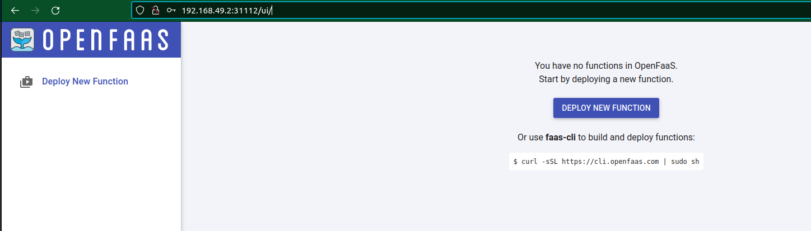
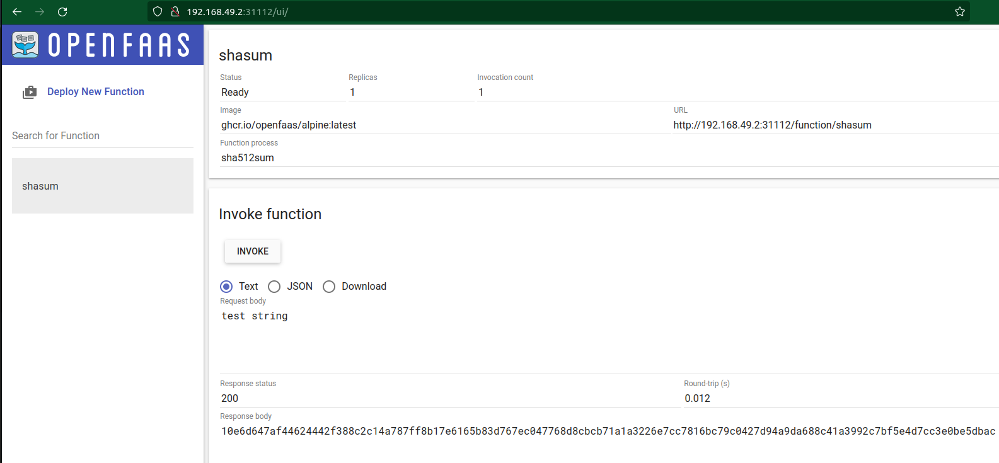

# FIRST STEPS WITH OPENFAAS

## Abstract
Getting started with OpenFaas.
<br/>

For this tutorial we will use `minikube`.

## Instructions
Fire up minikube:
<br/>
```console
minikube start
```

Install OpenFaas with <a href="https://github.com/alexellis/arkade">Arkade</a>:
<br/>

```console
curl -SLsf https://get.arkade.dev/ | sudo sh && arkade install openfaas
```
<br/>

Inspect the pods inside the `openfaas` namespace:
```console
kubectl get pods -n openfaas -w

NAME                                 READY   STATUS    RESTARTS      AGE
alertmanager-849574dc9f-s96pm        1/1     Running   0             29m
basic-auth-plugin-5fb944df56-hpd96   1/1     Running   0             29m
gateway-7d45f4f8c7-dq2bv             2/2     Running   1 (24m ago)   29m
nats-5b77986b8-bdqmw                 1/1     Running   0             29m
prometheus-574bdf4d9f-n974h          1/1     Running   0             29m
queue-worker-5c8bc6dbd8-98ch7        1/1     Running   5 (25m ago)   29m
```

Inspect the secret `basic-auth `for the `openfaas` namespace:
<br/>

```console
kubectl edit secrets -n openfaas basic-auth
```

<br/>

Base64-decode the username and the password fields.
<br/>

With them you can connect to the openfaas web ui:
<br/>
<div style="width: 65%; height: 65%">

  
  
</div>  
<br/>  

Or connect `faas-cli` to your deployment:
<br/>

```console
export OPENFAAS_URL=$(minikube ip):31112 && echo zr08Ghcz8bgk7LNK11z21nj39 | faas-cli login -g http://$OPENFAAS_URL -u admin --password-stdin

Calling the OpenFaaS server to validate the credentials...
WARNING! You are not using an encrypted connection to the gateway, consider using HTTPS.
credentials saved for admin http://192.168.49.2:31112
```
From the dashboard you can deploy a new function.  
Click the Button and select the function `shasum` from the `FROM STORE` tab.  
CLick deploy and inspect the pods in the `openfaas-fn` namespace:  
```console
kubectl get pods -n openfaas-fn

NAME                        READY   STATUS    RESTARTS   AGE
shasum-d4886fdf8-j7d84       1/1    Running   0          3m13s
```  
From the dashboard you can interact with this function:  
<br/>
<div style="width: 65%; height: 65%">

  
  
</div>  
<br/> 

Now we will build this repo image on localhost (you need docker for this):
<br/>

```console
faas-cli build -f ./hello-python.yml && docker images | grep hello-python

0] > Building hello-python.
Clearing temporary build folder: ./build/hello-python/
Preparing: ./hello-python/ build/hello-python/function
Building: hello-python:latest with python template. Please wait..
Sending build context to Docker daemon  8.192kB
Step 1/31 : FROM --platform=${TARGETPLATFORM:-linux/amd64} ghcr.io/openfaas/classic-watchdog:0.2.1 as watchdog
.
.
.
.
.
hello-python                        latest       62d3132af2d9   1 minutes ago   87.2MB
```  
At this point you can publish this image to a docker registry in order  
to have it available on your *K8S* cluster.


