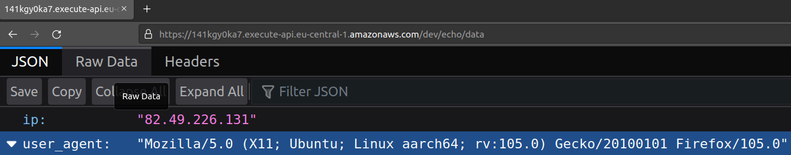

# FIRST STEPS WITH SERVERLESS FRAMEWORK

## Abstract
Getting started with serverless framework and aws!

## Instructions
This tutorial is done on `Ubuntu 22.04`.
<br/>
First of all you need to install Node.js, 
<br/>
if you already have it you can skip this step.
<br/>

To install the latest Node.js on ubuntu 22.04, run this command:
<br/>

```console
curl -sL https://deb.nodesource.com/setup_18.x | sudo -E bash - && sudo apt install nodejs && node -v && npm -v
```

If everything is ok, this command should ouput the latest stable version of node.js and npm, for example:
<br/>
```console
v18.11.0
8.19.2
```

Next we will install **serverless framework** via **npm** (*node package manager*):
<br/>
```console
sudo npm install -g serverless && serverless --version
```
If everything is ok, this command should ouput the serverless-framework version:
<br/>
```console
Framework Core: 3.23.0
Plugin: 6.2.2
SDK: 4.3.2
```
In the future, you will be able to update the version of serverless framework by simply re-running the above command.
<br/>

In this tutorial we will use <a href="https://aws.amazon.com/">aws</a> as our cloud provider so firts we will need to create
a new application user for our serverless environment.
<br/>
For that you can follow instructions <a href="https://www.serverless.com/framework/docs/providers/aws/guide/credentials">here</a>.

In my case I have created a `serverless-dev` user and saved his keys into a profile
<br/>

named `serverless-dev` inside `~/.aws/credentials`.
<br/>

Next we can deploy our first function (this will return our ip addres and user-agent):
<br/>

```console
serverless deploy --aws-profile serverless-dev

Deploying first-function to stage dev (eu-central-1)

✔ Service deployed to stack first-function-dev (108s)

endpoint: GET - https://1oquvmnm34.execute-api.eu-central-1.amazonaws.com/dev/echo/data
functions:
  show_data: first-function-dev-show_data (57 kB)
```  
This command creates a new api-gateway and a new labda in our aws account, 
<br/>

inside the region specified in the `serverless.yml` manifest.
<br/>

API-GATEWAY:
<br/>
<div style="width: 65%; height: 65%">

  
  
</div>  
<br/>  

LAMBDA:
<br/>
<div style="width: 65%; height: 65%">

  
  
</div>  
<br/>  


If we open the browser and go to the specified endpoint url:
<br/>
<div style="width: 65%; height: 65%">

  
  
</div>  
<br/>  

We can also invoke this function from serverless CLI, note that in this case our function
give an exception since it cannot retrieve the user agent:
<br/>
```console
serverless invoke -f show_data --aws-profile serverless-dev
{
    "statusCode": 500,
    "body": "'requestContext'"
}
```

We can also visualize function call logs with the following commands:
<br/>

```console
serverless invoke -f show_data --log --aws-profile serverless-dev
{
    "statusCode": 500,
    "body": "'requestContext'"
}
--------------------------------------------------------------------
START
END Duration: 1.21 ms (init: 116.61 ms) Memory Used: 38 MB
```

Serverless framework also offers a dashboard, fire it up by running the following command inside the project dir:
<br/>

```console
serverless

Onboarding "first-function" to the Serverless Dashboard

? Do you want to login/register to Serverless Dashboard? Yes
Logging into the Serverless Dashboard via the browser
If your browser does not open automatically, please open this URL:
https://app.serverless.com?client=cli&transactionId=7IKrwntUfVaLD3r_FNrot
```
<br/>

Login to your dashboard:
<br/>
<div style="width: 65%; height: 65%">

  
  
</div>  
<br/>  

Run the specified command to onboard your project on the dashboard:
<br/>

```console
serverless --org=r3drun3

Onboarding "first-function" to the Serverless Dashboard


✔ Your project is ready to be deployed to Serverless Dashboard (org: "r3drun3", app: "first-function")
```
Now you can edit your function from the dashboard:
<br/>
<div style="width: 65%; height: 65%">

  
  
</div>  
<br/>  

If you want to delete your project and release all the created resources
 <br/>
you can do it with the following commands:
<br/>
```console 
serverless remove --aws-profile serverless-dev
Removing first-function from stage dev (eu-central-1)

✔ Service first-function has been successfully removed (33s)
```


