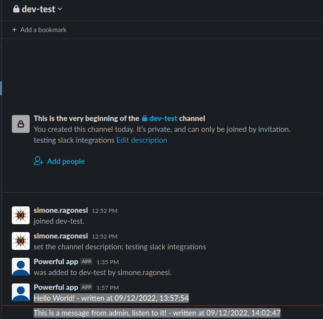

# SIMPLE SERVERLESS SLACK APP

We will create a simple serverless slack app.

<br/>

## Instructions
First of all you need to create a slack app and add that app to your channel.
<br/>
See official docs <a href="https://api.slack.com/start">here</a>.

<br/>

Next you need to create a local file `serverless.env.yml` with this structure:  
```console
cat serverless.env.yml
SLACK_TOKEN: <your_token>
SLACK_CHANNEL: <your-channel-name>
```

<br/>

Next you need to execute the following command on the local machine:  
```console
pip install -r requirements.txt -t vendored && serverless deploy
```

<br/>


Next retrieve you aws api endpoint (from the previous command output) and call your api:  


```console
curl -X POST <your-aws-api-endpoint> -H 'Content-Type: application/json' -d '{"data":"Hello World!"}'
```

<br/>


The following are the messages that appears in our slack channel!  
<div style="width: 65%; height: 65%">

  
  
</div>  
<br/>


<br/>

To release all created resources:  
```console
serverless remove
```

