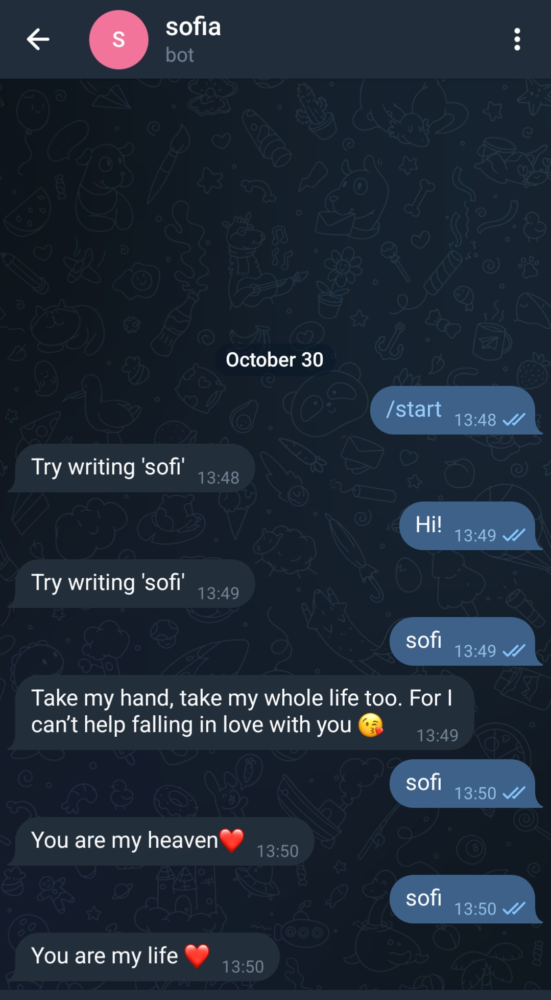

# TELEGRAM BOT


## Abstract
Creating a serverless telegram bot with `serverless framework`.

## Instructions
This has been tested on `Ubuntu 22.04` and it has been is inspired by <a href="https://medium.com/hackernoon/serverless-telegram-bot-on-aws-lambda-851204d4236c">this</a> article.
<br/>

It is recommended to follow the `first-steps` tutorial first.

<br/>

First of all you need to have a Telegram account and you need to create a new bot.
<br/>
For this just start a new chat with <a href="https://telegram.me/BotFather">this</a> channel.
<br/>
This will generate a new telegram bot and will return a Tekegram API Token.
<br/>

Next you need to create a local file with your telegram token:
<br/>
```console
cat serverless.env.yml
TELEGRAM_TOKEN: <your_token>
```

Execute the following command on the local machine:
<br/>

```console
pip install -r requirements.txt -t vendored && serverless deploy
```

<br/>

Next retrieve you aws api endpoint (from the previous command output) and generate a webhook for your telegram bot:

```console
curl --request POST --url https://api.telegram.org/botYOUR_TOKEN_HERE/setWebhook --header 'content-type: application/json' --data '{"url": "https://fne8ywzto7.execute-api.eu-central-1.amazonaws.com/dev/chat"}'    

{"ok":true,"result":true,"description":"Webhook was set"}%
```

Now you can chat with your bot!!
<br/>
<div style="width: 65%; height: 65%">

  
  
</div>  
<br/>  

To release all created resources:
<br/>
```console
serverless remove
```


